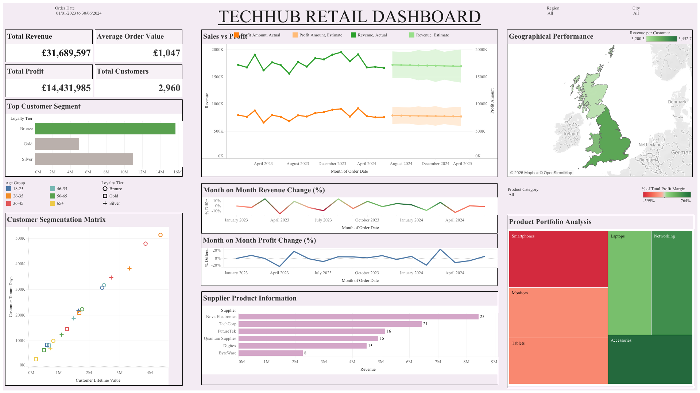

# Customer Churn Analysis Dashboard

📊 **Tool:** Tableau  
📁 **Data:** Customer churn dataset  
🌐 **View Interactive Dashboard:** [Click Here](https://public.tableau.com/app/profile/apurva.dalvi/viz/TechHub_RetailDashboard/Dashboard1)

## Overview
This Tableau dashboard visualizes customer churn patterns by region, plan type, and engagement metrics.  
It provides actionable insights into high-risk customer segments.

